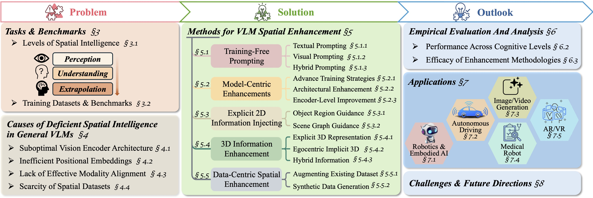
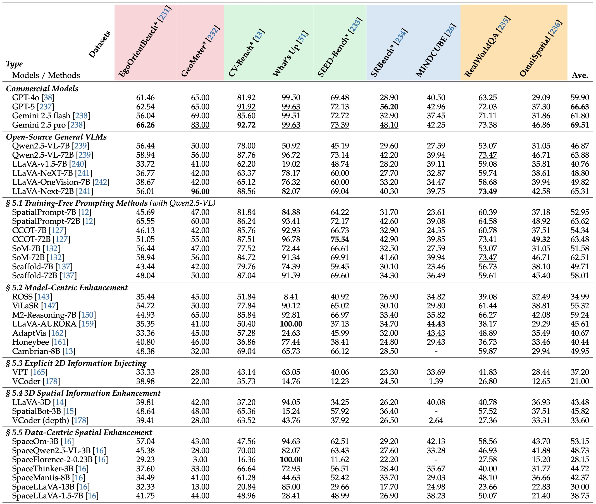

 <h1 align="center" style="font-size: 1.7rem">
  🚀 Awesome Spatial VLMs
  <a href="https://github.com/sindresorhus/awesome">
    
  </a>
  <a href="https://github.com/vulab-AI/Awesome-Spatial-VLMs/commits/main/">
    
  </a>
</h1>
<!-- 
  <p align="center">
    <a href="https://scholar.google.com/citations?user=xlIBwREAAAAJ&hl=en">Disheng Liu</a>,
    <a href="https://jiagengliu02.github.io/">Tuo Liang</a>,
    <a href="https://scholar.google.com/citations?user=oV8sqb0AAAAJ&hl=zh-CN">Zhe Hu</a>,
    <a href="https://scholar.google.com/citations?user=7CLFLX0AAAAJ&hl=en">Jierui Peng</a>,
    <a href="https://yiren-lu.com/">Yiren Lu</a>,
    <a href="https://sites.google.com/view/homepage-of-yi-xu">Yi Xu</a>,
    <a href="https://www1.ece.neu.edu/~yunfu/">Yun Fu</a>,
    <a href="https://yin-yu.github.io/">Yu Yin</a>
  </p> -->

> A curated list of resources for Spatial Intelligence in Vision-Language Models.

This repository is the official, community-maintained resource for the survey paper: **Spatial Intelligence in Vision-Language Models: A Comprehensive Survey**

<p align="center">
<a href="https://www.techrxiv.org/users/992599/articles/1354538-spatial-intelligence-in-vision-language-models-a-comprehensive-survey">
  </a>&nbsp;
  <a href="https://github.com/vulab-AI/Awesome-Spatial-VLMs/blob/main/Spatial_VLM_survey.pdf"></a>&nbsp;
  <a href="https://huggingface.co/datasets/LLDDSS/Awesome_Spatial_VQA_Benchmarks"></a>&nbsp;
  <a href="https://github.com/vulab-AI/Awesome-Spatial-VLMs/blob/main/evaluation/README.md"></a>
</p>

🤝 This repository will be continuously updated, and we warmly invite contributions. **If you have a paper, dataset, or model to add, please submit a pull request or open an issue for discussion.**


## Table of Contents
- [Table of Contents](#table-of-contents)
- [Overview](#overview)
- [🚀 Awesome Papers](#-awesome-papers)
  - [Training-Free Prompting](#training-free-prompting)
    - [Textual Prompting Methods](#textual-prompting-methods)
    - [Visual Prompting Methods](#visual-prompting-methods)
    - [Hybrid Prompting](#hybrid-prompting)
  - [Model-Centric Enhancements](#model-centric-enhancements)
    - [Advanced Training Strategies](#advanced-training-strategies)
    - [Architectural Enhancements](#architectural-enhancements)
    - [Encoder-Level Improvements](#encoder-level-improvements)
  - [Explicit 2D Information Injection](#explicit-2d-information-injection)
    - [Object Region Guidance](#object-region-guidance)
    - [Explicit spatial relationship](#explicit-spatial-relationship)
  - [3D Information Enhancement](#3d-information-enhancement)
    - [Explicit 3D Geometric Representations](#explicit-3d-geometric-representations)
    - [Implicit 3D from Egocentric Views](#implicit-3d-from-egocentric-views)
    - [Scene-level information + Ego-centric](#scene-level-information--ego-centric)
  - [Data-Centric Spatial Enhancement](#data-centric-spatial-enhancement)
    - [Manifesting Spatial Relations in 2D Images](#manifesting-spatial-relations-in-2d-images)
    - [Manifesting Spatial Priors in 3D and Synthetic Worlds](#manifesting-spatial-priors-in-3d-and-synthetic-worlds)
- [📚 Datasets and Benchmarks](#-datasets-and-benchmarks)
  - [Spatially-Oriented Training Corpora](#spatially-oriented-training-corpora)
  - [Evaluation Benchmarks](#evaluation-benchmarks)
- [🏆 Spatial VLM Leaderboard \& Evaluation Toolkit](#-spatial-vlm-leaderboard--evaluation-toolkit)
  - [🏅 Main Leaderboard](#-main-leaderboard)
  - [🧑‍🔬 How to Evaluate Your Model](#-how-to-evaluate-your-model)
- [Citation](#citation)


## Overview
This repository uses the framework from our survey paper to systematically organize the field of Spatial Intelligence in VLMs.
- **The “What”: A Cognitive Hierarchy** 🧩  
  We define spatial intelligence as a 3-level hierarchy, and group tasks, datasets, and benchmarks by required capability:  
  **L1** *Perception* of intrinsic 3D attributes (e.g., size, orientation) &rarr; **L2** relational *Understanding* &rarr; **L3** *Extrapolation* (e.g., hidden-state inference, future prediction).
- **The “How”: A Taxonomy of Methods** 🚀  
  Methods are organized into five families, giving you a clear map of the current landscape. See details in [🚀 Awesome Papers](#-awesome-papers).
- **Where We Are: Evaluation Results and Toolkit** 🏆  
  See how current models perform! 
  - **Standardized Leaderboard:** We report results for **37+ VLMs** across all L1/L2/L3 tasks.
  - **Open Evaluation Toolkit:** Reproduce our protocols and **evaluate your own models** under the same settings.

<div align='center'></div>

  <!-- - **L1: Spatial Perception:** Recognizing individual objects and their intrinsic 3D attributes (e.g., size, orientation, 3D segmentation).
  - **L2: Spatial Understanding:** Reasoning about the extrinsic, relational properties among multiple objects (e.g., "the dog to the left of the cat").
  - **L3: Spatial Extrapolation:** Inferring hidden states, predicting future configurations, or reasoning from a situated perspective (e.g., mental rotation, pathfinding). -->


## 🚀 Awesome Papers
### Training-Free Prompting
#### Textual Prompting Methods

  - [CoRR2023] Enhancing the Spatial Awareness Capability of Multi-Modal Large Language Model (_Peking University_) [[paper]](https://arxiv.org/pdf/2310.20357);

  - [CVPR2024] Compositional Chain-of-Thought Prompting for Large Multimodal Models (_University of California, Berkeley_) [[paper]](https://arxiv.org/pdf/2311.17076) [[code]](https://github.com/chancharikmitra/CCoT);

  - [EMNLP2024] Reasoning Paths with Reference Objects Elicit Quantitative Spatial Reasoning in Large Vision-Language Models (_University of Toronto_) [[paper]](https://arxiv.org/abs/2409.09788) [[code]](https://github.com/andrewliao11/Q-Spatial-Bench-code);

  - [NeurIPS2024] SpatialPIN: Enhancing Spatial Reasoning Capabilities of Vision-Language Models through Prompting and Interacting 3D Priors (_University of Oxford_) [[paper]](https://arxiv.org/pdf/2403.13438) [[code]](https://github.com/dannymcy/zeroshot_task_hallucination_code);

  - [CoRR2025] SoFar: Language-Grounded Orientation Bridges Spatial Reasoning and Object Manipulation (_Tsinghua University_) [[paper]](https://arxiv.org/pdf/2502.13143) [[code]](https://github.com/qizekun/SoFar);

#### Visual Prompting Methods

- [arXiv2023] Set-of-Mark Prompting Unleashes Extraordinary Visual Grounding in GPT-4V (_Microsoft Research, Redmond_) [[paper]](https://arxiv.org/pdf/2310.11441) [[code]](https://github.com/microsoft/SoM);

- [NeurIPS2023] Fine-Grained Visual Prompting (_Nanjing University of Science and Technology_) [[paper]](https://proceedings.neurips.cc/paper_files/paper/2023/file/4e9fa6e716940a7cfc60c46e6f702f52-Paper-Conference.pdf) [[code]](https://github.com/ylingfeng/FGVP);

- [arXiv2024] I Know About “Up”! Enhancing Spatial Reasoning in Visual Language Models Through 3D Reconstruction (_Guangdong Polytechnic Normal University_) [[paper]](https://arxiv.org/pdf/2407.14133);

- [arXiv2025]; Mindjourney: Test-time scaling with world models for spatial reasoning (UMass Amherst) [[paper]](https://arxiv.org/pdf/2507.12508) [[code]](https://github.com/UMass-Embodied-AGI/MindJourney);

- [CVPR2025] Coarse Correspondences Boost Spatial-Temporal Reasoning in Multimodal Language Model (_University of Washington_) [[paper]](https://openaccess.thecvf.com/content/CVPR2025/papers/Liu_Coarse_Correspondences_Boost_Spatial-Temporal_Reasoning_in_Multimodal_Language_Model_CVPR_2025_paper.pdf);

- [Neurocomputing2025] 3DAxisPrompt: Promoting the 3d grounding and reasoning in gpt-4o (_Shanghai AI Lab_) [[paper]](https://www.sciencedirect.com/science/article/abs/pii/S0925231225007441);

#### Hybrid Prompting

- [arXiv2024] Image-of-Thought Prompting for Visual Reasoning Refinement in Multimodal Large Language Models (_Westlake University_) [[paper]](https://arxiv.org/pdf/2405.13872);

- [NeurIPS2024] Mind's Eye of LLMs: Visualization-of-Thought Elicits Spatial Reasoning in Large Language Models (_Microsoft Research_) [[paper]](https://phttps://arxiv.org/pdf/2405.13872roceedings.neurips.cc/paper_files/paper/2024/file/a45296e83b19f656392e0130d9e53cb1-Paper-Conference.pdf) [[code]](https://github.com/microsoft/visualization-of-thought/);

- [NeurIPS2024] Visual SKETCHPAD: Sketching as a visual chain of thought for multimodal language models (University of Washington) [[paper]](https://arxiv.org/pdf/2406.09403) [[code]](https://github.com/Yushi-Hu/VisualSketchpad);

- [arXiv2025]; SpatialPrompting: Keyframe-driven Zero-Shot Spatial Reasoning with Off-the-Shelf Multimodal Large Language Models (Toyota Central R&D Labs) [[paper]](https://arxiv.org/pdf/2505.04911v1);

- [COLING2025]; Scaffolding coordinates to promote vision-language coordination in large multi-modal models (Tsinghua University) [[paper]](https://arxiv.org/pdf/2402.12058) [[code]](https://github.com/THUNLP-MT/Scaffold);

- [CVPR2025] SeeGround: See and Ground for Zero-Shot Open-Vocabulary 3D Visual Grounding (_HKUST(Guangzhou)_) [[paper]](https://arxiv.org/pdf/2412.04383) [[code]](https://github.com/iris0329/SeeGround);

---

### Model-Centric Enhancements
#### Advanced Training Strategies

- [arXiv2023] What Makes for Good Visual Tokenizers for Large Language Models (_National University of Singapore 2ARC Lab_) [[paper]](https://arxiv.org/pdf/2305.12223) [[code]](https://github.com/TencentARC/GVT) [[checkpoint]](https://github.com/TencentARC/GVT/tree/master/gvt);

- [arXiv2025] SpatialCoT: Advancing Spatial Reasoning through Coordinate Alignment and Chain-of-Thought for Embodied Task Planning (_Huawei Noah's Ark Lab_) [[paper]](https://arxiv.org/pdf/2501.10074);

- [arXiv2025] SpaceR: Reinforcing MLLMs in Video Spatial Reasoning (_Peking University_) [[paper]](https://arxiv.org/pdf/2504.01805v2) [[code]](https://github.com/OuyangKun10/SpaceR?tab=readme-ov-file) [[checkpoint]](https://huggingface.co/RUBBISHLIKE/SpaceR);

- [arXiv2025] ViLaSR: Reinforcing Spatial Reasoning in Vision-Language Models with Interwoven Thinking and Visual Drawing (_Institute of Automation, Chinese Academy of Sciences_) [[paper]](https://arxiv.org/abs/2506.09965) [[code]](https://github.com/AntResearchNLP/ViLaSR) [[checkpoint]](https://huggingface.co/inclusionAI/ViLaSR/tree/main);

- [arXiv2025] M2-Reasoning: Empowering MLLMs with Unified General and Spatial Reasoning (_Inclusion AI, Ant Group_) [[paper]](https://arxiv.org/pdf/2507.08306) [[code]](https://github.com/inclusionAI/M2-Reasoning) [[checkpoint]](https://huggingface.co/inclusionAI/M2-Reasoning);

- [arXiv2025] Improved Visual-Spatial Reasoning via R1-Zero-Like Training (_Shanghai Jiao Tong University_) [[paper]](https://arxiv.org/pdf/2504.00883) [[code]](https://github.com/zhijie-group/R1-Zero-VSI)

- [arXiv2025] SVQA-R1: Reinforcing Spatial Reasoning in MLLMs via View-Consistent Reward Optimization (_Stony Brook University_) [[paper]](https://arxiv.org/pdf/2506.01371);

- [arXiv2025] Embodied-R: Collaborative Framework for Activating Embodied Spatial Reasoning in Foundation Models via Reinforcement Learning (_Tsinghua University_) [[paper]](https://arxiv.org/pdf/2504.12680) [[code]](https://github.com/EmbodiedCity/Embodied-R.code) [[checkpoint]](https://huggingface.co/EmbodiedCity/Embodied-R);

- [arXiv2025] SpatialLadder: Progressive Training for Spatial Reasoning in Vision-Language Models (_Zhejiang University_) [[paper]](https://arxiv.org/pdf/2510.08531) [[code]](https://github.com/zju-real/SpatialLadder) [[checkpoint]](https://huggingface.co/hongxingli/SpatialLadder-3B);

- [arXiv2025] MetaSpatial: Reinforcing 3D Spatial Reasoning in VLMs for the Metaverse (_Northwestern University_) [[paper]](https://arxiv.org/pdf/2503.18470) [[code]](https://github.com/PzySeere/MetaSpatial);

- [CVPR2025] Perception Tokens Enhance Visual Reasoning in Multimodal Language Models (_University of Washington_) [[paper]](https://arxiv.org/pdf/2412.03548v1) [[code]](https://github.com/mahtabbigverdi/Aurora-perception) [[checkpoint]](https://drive.google.com/file/d/1r7WYQWYA6VDpzfxPIHP1zEUgBYQmwNIj/view);

- [ICLR2025] Ross: Reconstructive Visual Instruction Tuning (_Institute of Automation, Chinese Academy of Sciences_) [[paper]](https://arxiv.org/pdf/2410.09575) [[code]](https://github.com/haochen-wang409/ross) [[checkpoint]](https://huggingface.co/HaochenWang/ross-qwen2-7b);

- [ICLR2025] Language-Image Models with 3D Understanding (Cube-LLM) (_UT Austin_) [[paper]](https://arxiv.org/pdf/2405.03685);

- [ICLR2025] Locality Alignment Improves Vision-Language Models (_Stanford University_) [[paper]](https://arxiv.org/pdf/2410.11087) [[code]](https://github.com/iancovert/locality-alignment/?tab=readme-ov-file);

- [ICML2025] Imagine while Reasoning in Space: Multimodal Visualization-of-Thought (_Microsoft Research_) [[paper]](https://arxiv.org/pdf/2501.07542) [[code]](https://github.com/chengzu-li/MVoT);

- [NeurIPS2025] SpatialReasoner: Towards Explicit and Generalizable 3D Spatial Reasoning, (_Johns Hopkins University_) [[paper]](https://arxiv.org/pdf/2504.20024) [[code]](https://github.com/johnson111788/SpatialReasoner) [[checkpoint]](https://huggingface.co/collections/ccvl/spatialreasoner-68114caec81774edbf1781d3);

- [NeurIPS2025] Fine-Grained Preference Optimization Improves Spatial Reasoning in VLMs (_UIUC_) [[paper]](https://arxiv.org/pdf/2506.21656);


#### Architectural Enhancements

- [CVPR2024] Honeybee: Locality Enhanced Projector for Multimodal LLM (_Kakao Brain_) [[paper]](https://openaccess.thecvf.com/content/CVPR2024/papers/Cha_Honeybee_Locality-enhanced_Projector_for_Multimodal_LLM_CVPR_2024_paper.pdf) [[code]](https://github.com/khanrc/honeybee) [[checkpoint]](https://github.com/khanrc/honeybee);

- [ECCV2024] Contrastive Region Guidance: Improving Grounding in Vision-Language Models without Training (_unc_) [[paper]](https://arxiv.org/pdf/2403.02325) [[code]](https://github.com/meetdavidwan/crg) [[checkpoint]](https://github.com/meetdavidwan/crg);

- [EMNLP2024] To Preserve or To Compress: An In-Depth Study of Connector Selection in Multimodal Large Language Models (_Digital Twin Institute, Eastern Institute of Technology, China_) [[paper]](https://arxiv.org/pdf/2410.06765v1) [[code]](https://github.com/EIT-NLP/Connector-Selection-for-MLLM);

- [NeurIPS2024] Cambrian-1: A Fully Open, Vision-Centric Exploration of Multimodal LLM (_New York University_) [[paper]](https://arxiv.org/pdf/2406.16860) [[code]](https://github.com/cambrian-mllm/cambrian) [[checkpoint]](https://huggingface.co/collections/nyu-visionx/cambrian-1-models-666fa7116d5420e514b0f23c);

- [ICML2025] Why is Spatial Reasoning Hard for VLMs? An Attention Mechanism Perspective on Focus Areas (_City University of Hong Kong_) [[paper]](https://arxiv.org/pdf/2503.01773) [[code]](https://github.com/shiqichen17/AdaptVis) [[checkpoint]](https://github.com/shiqichen17/AdaptVis);


#### Encoder-Level Improvements

- [ICML2024] Prismatic VLMs: Investigating the Design Space of Visually-Conditioned Language Models (_Stanford_) [[paper]](https://arxiv.org/pdf/2402.07865) [[code]](https://github.com/TRI-ML/prismatic-vlms?tab=readme-ov-file#pretrained-models) [[checkpoint]](https://github.com/TRI-ML/prismatic-vlms);

- [NeurIPS2024] Cambrian-1: A Fully Open, Vision-Centric Exploration of Multimodal LLM (_New York University_) [[paper]](https://arxiv.org/pdf/2406.16860) [[code]](https://github.com/cambrian-mllm/cambrian) [[checkpoint]](https://huggingface.co/collections/nyu-visionx/cambrian-1-models-666fa7116d5420e514b0f23c);

- [arXiv2025] Introducing Visual Perception Token into Multimodal Large Language Model (_National University of Singapore_) [[paper]](https://arxiv.org/pdf/2502.17425) [[code]](https://github.com/yu-rp/VisualPerceptionToken?tab=readme-ov-file) [[checkpoint]](https://huggingface.co/collections/rp-yu/vpt-models-67b6afdc8679a05a2876f07a);

- [CVPR2025] SpatialCLIP: Learning 3D-aware Image Representations from Spatially Discriminative Language (_Zhejiang University_) [[paper]](https://openaccess.thecvf.com/content/CVPR2025/papers/Wang_SpatialCLIP_Learning_3D-aware_Image_Representations_from_Spatially_Discriminative_Language_CVPR_2025_paper.pdf) [[code]](https://github.com/SpatialVision/Spatial-CLIP);

- [CVPR2025] SpatialLLM: A Compound 3D-Informed Design towards Spatially-Intelligent Large Multimodal Models (_Johns Hopkins University_) [[paper]](https://www.cs.jhu.edu/~alanlab/Pubs25/ma2025spatialllm.pdf) [[code]](https://3d-spatial-reasoning.github.io/spatial-llm/#public);

- [CVPR2025] Argus: A Compact and Versatile Foundation Model for Vision (_University of Illinois Urbana-Champaign_) [[paper]](https://openaccess.thecvf.com/content/CVPR2025/papers/Zhuang_Argus_A_Compact_and_Versatile_Foundation_Model_for_Vision_CVPR_2025_paper.pdf);

- [ICLR2025] Eagle 2: Building Post-Training Data Strategies from Scratch for Frontier Vision-Language Models (_NVIDIA_) [[paper]](https://arxiv.org/pdf/2501.14818) [[code]](https://github.com/NVlabs/EAGLE?tab=readme-ov-file) [[checkpoint]](https://huggingface.co/nvidia/Eagle2.5-8B);

- [IJCAI2025] Incorporating Visual Experts to Resolve the Information Loss in Multimodal Large Language Models (_Huawei_) [[paper]](https://arxiv.org/pdf/2401.03105);

--------


### Explicit 2D Information Injection
#### Object Region Guidance

- [EMNLP2022] PEVL: Position-enhanced Pre-training and Prompt Tuning for Vision-language Models (_Tsinghua University_) [[paper]](https://arxiv.org/pdf/2205.11169) [[code]](https://github.com/thunlp/PEVL) [[checkpoint]](https://github.com/thunlp/PEVL);

- [CoRR2023] Position-Enhanced Visual Instruction Tuning for Multimodal Large Language Models (_Tsinghua University_) [[paper]](https://arxiv.org/pdf/2308.13437) [[code]](https://github.com/PVIT-official/PVIT?tab=readme-ov-file#pvit-weights) [[checkpoint]](https://huggingface.co/PVIT/pvit);

- [CVPR2024] RegionGPT: Towards Region Understanding Vision Language Model (_Nvidia_) [[paper]](https://arxiv.org/pdf/2403.02330);

- [CVPR2024] VCoder: Versatile Vision Encoders for Multimodal Large Language Models (_Georgia Tech_) [[paper]](https://arxiv.org/pdf/2312.14233) [[code]](https://github.com/SHI-Labs/VCoder) [[checkpoint]](https://huggingface.co/models?search=vcoder);

- [CVPR2024] Learning to Localize Objects Improves Spatial Reasoning in Visual-LLMs (_Meta_) [[paper]](https://arxiv.org/pdf/2404.07449);

- [ECCVWorkshops2024] GPT4RoI: Instruction Tuning Large Language Model on Region-of-Interest (_The University of Hong Kong_) [[paper]](https://arxiv.org/pdf/2307.03601) [[code]](https://github.com/jshilong/GPT4RoI?tab=readme-ov-file) [[checkpoint]](https://huggingface.co/shilongz/GPT4RoI-7B-delta-V0);

- [ICLR2024] CoVLM: Composing Visual Entities and Relationships in Large Language Models Via Communicative Decoding (_UMass Amherst_) [[paper]](https://arxiv.org/abs/2311.03354) [[code]](https://github.com/UMass-Embodied-AGI/CoVLM?tab=readme-ov-file) [[checkpoint]](https://github.com/UMass-Embodied-AGI/CoVLM?tab=readme-ov-file);

- [arXiv2025] Lyrics: Boosting Fine-grained Language-Vision Alignment and Comprehension via Semantic-aware Visual Objects (_International Digital Economy Academy_) [[paper]](https://arxiv.org/pdf/2312.05278);

- [CVPR2025] Argus: A Compact and Versatile Foundation Model for Vision (_University of Illinois Urbana-Champaign_) [[paper]](https://openaccess.thecvf.com/content/CVPR2025/papers/Zhuang_Argus_A_Compact_and_Versatile_Foundation_Model_for_Vision_CVPR_2025_paper.pdf);

#### Explicit spatial relationship

- [ACL2023] Incorporating Structured Representations into Pretrained Vision & Language Models Using Scene Graphs (_Tel-Aviv University_) [[paper]](https://arxiv.org/pdf/2305.06343) [[code]](https://github.com/AlonMendelson/SGVL) [[checkpoint]](https://drive.google.com/file/d/13jzpcLgGalO3hkiqVwziNAlCEZD90ENN/view);

- [arXiv2025] Object-centric Binding in Contrastive Language-Image Pretraining (_Meta_) [[paper]](https://arxiv.org/pdf/2502.14113);

- [arXiv2025] Seeing Beyond the Scene: Enhancing Vision-Language Models with Interactional Reasoning (_South China University of Technology_) [[paper]](https://arxiv.org/pdf/2505.09118);

- [arXiv2025] LLaVA-SG: Leveraging Scene Graphs as Visual Semantic Expression in Vision-Language Models (_Tsinghua University_) [[paper]](https://arxiv.org/pdf/2408.16224);

---

### 3D Information Enhancement
#### Explicit 3D Geometric Representations

- [CVPR2022] ScanQA: 3D Question Answering for Spatial Scene Understanding (_Kyoto University_) [[paper]](https://arxiv.org/pdf/2112.10482) [[code]](https://github.com/ATR-DBI/ScanQA);

- [NeurIPS2023] 3D-LLM: Injecting the 3D World into Large Language Models (_UCLA_) [[paper]](https://arxiv.org/pdf/2307.12981) [[code]](https://github.com/UMass-Embodied-AGI/3D-LLM);

- [CVPR2024] LL3DA: Visual Interactive Instruction Tuning for Omni-3D Understanding, Reasoning, and Planning (_Fudan University_) [[paper]](https://arxiv.org/pdf/2311.18651) [[code]](https://github.com/Open3DA/LL3DA);

- [CVPR2024] Situational Awareness Matters in 3D Vision Language Reasoning (_UIUC_) [[paper]](https://arxiv.org/pdf/2406.07544) [[code]](https://github.com/YunzeMan/Situation3D);

- [CVPR2024] VCoder: Versatile Vision Encoders for Multimodal Large Language Models (_Georgia Tech_) [[paper]](https://arxiv.org/pdf/2312.14233) [[code]](https://github.com/SHI-Labs/VCoder) [[checkpoint]](https://huggingface.co/models?search=vcoder);

- [ECCV2024] SegPoint: Segment Any Point Cloud via Large Language Model (_Nanyang Technological University_) [[paper]](https://arxiv.org/pdf/2407.13761) [[code]](https://github.com/heshuting555/);

- [NeurIPS2024] SpatialRGPT: Grounded Spatial Reasoning in Vision-Language Models (_UC San Diego_) [[paper]](https://arxiv.org/pdf/2406.01584) [[code]](https://github.com/AnjieCheng/SpatialRGPT) [[checkpoint]](https://huggingface.co/collections/a8cheng/spatialrgpt-grounded-spatial-reasoning-in-vlms-66fef10465966adc81819723);

- [arXiv2025] Spatial 3D-LLM: Progressive Spatial Awareness for Advanced 3D Vision-Language Understanding (_Beijing Digital Native Digital City Research Center_) [[paper]](https://openreview.net/pdf?id=JzLcKWtGnl);

- [CVPR2025] 3D-LLaVA: Towards Generalist 3D LMMs with Omni Superpoint Transformer (_The University of Adelaide_) [[paper]](https://arxiv.org/pdf/2501.01163) [[code]](https://github.com/djiajunustc/3D-LLaVA?tab=readme-ov-file) [[checkpoint]](https://huggingface.co/djiajunustc/3D-LLaVA-7B-LoRA);

- [CVPR2025] LSceneLLM: Enhancing Large 3D Scene Understanding Using Adaptive Visual Preferences (_South China University of Technology_) [[paper]](https://arxiv.org/pdf/2412.01292) [[code]](https://github.com/Hoyyyaard/LSceneLLM) [[checkpoint]](https://huggingface.co/Hoyard/LSceneLLM);

- [ICCVW2025] SmolRGPT: Efficient Spatial Reasoning for Warehouse Environments with 600M Parameters (_Universit de Moncton_) [[paper]](https://arxiv.org/pdf/2509.15490) [[code]](https://github.com/abtraore/SmolRGPT) [[checkpoint]](https://huggingface.co/collections/Abdrah/smolrgpt-checkpoints-6893bad56127440ef250486e);

- [ICRA2025] SpatialBot: Precise Spatial Understanding with Vision Language Models (_Shanghai Jiao Tong University_) [[paper]](https://ieeexplore.ieee.org/abstract/document/11128671) [[code]](https://github.com/BAAI-DCAI/SpatialBot) [[checkpoint]](https://huggingface.co/RussRobin/SpatialBot-3B);

- [NeurIPS2025] RoboRefer: Towards Spatial Referring with Reasoning in Vision-Language Models for Robotics (_Beihang University_) [[paper]](https://arxiv.org/pdf/2506.04308) [[code]](https://github.com/Zhoues/RoboRefer) [[checkpoint]](https://huggingface.co/collections/Zhoues/roborefer-and-refspatial-6857c97848fab02271310b89);

- [NeurIPS2025] SSR: Enhancing Depth Perception in Vision-Language Models via Rationale-Guided Spatial Reasoning (_Westlake University_) [[paper]](https://arxiv.org/pdf/2505.12448) [[code]](https://github.com/yliu-cs/SSR) [[checkpoint]](https://huggingface.co/collections/yliu-cs/ssr-682d44496b64e4edd94092bb);

- [NeurIPS2025] SD-VLM: Spatial Measuring and Understanding with Depth-Encoded Vision-Language Models (_Zhejiang University_) [[paper]](https://arxiv.org/pdf/2509.17664) [[code]](https://github.com/cpystan/SD-VLM) [[checkpoint]](https://huggingface.co/cpystan/SD-VLM-7B);


#### Implicit 3D from Egocentric Views


- [arXiv2025] VLM-3R: Vision-Language Models Augmented with Instruction-Aligned 3D Reconstruction (_UT Austin_) [[paper]](https://arxiv.org/pdf/2505.20279) [[code]](https://github.com/VITA-Group/VLM-3R);

- [arXiv2025] Spatial-MLLM: Boosting MLLM Capabilities in Visual-based Spatial Intelligence (_Tsinghua University_) [[paper]](https://arxiv.org/pdf/2505.23747) [[code]](https://github.com/diankun-wu/Spatial-MLLM);

- [ICCV2025] SplatTalk: 3D VQA with Gaussian Splatting (_Georgia Institute of Technology_) [[paper]](https://arxiv.org/pdf/2503.06271) [[code]](https://splat-talk.github.io/);


#### Scene-level information + Ego-centric

- [CVPR2023] 3D Concept Learning and Reasoning from Multi-View Images (_UCLA_) [[paper]](https://arxiv.org/pdf/2303.11327) [[code]](https://github.com/evelinehong/3D-CLR-Official);

- [ECCV2024] ScanReason: Empowering 3D Visual Grounding with Reasoning Capabilities (_The University of Hong Kong_) [[paper]](https://arxiv.org/pdf/2407.01525) [[code]](https://github.com/ZCMax/ScanReason);

- [ICML2024] An Embodied Generalist Agent in 3D World (Beijing Institute for General Artificial Intelligence (_BIGAI_)) [[paper]](https://arxiv.org/pdf/2311.12871) [[code]](https://github.com/embodied-generalist/embodied-generalist) [[checkpoint]](https://huggingface.co/datasets/huangjy-pku/LEO_data/tree/main);

- [NeurIPS2024] Chat-Scene: Bridging 3D Scene and Large Language Models with Object Identifiers (_Zhejiang University_) [[paper]](https://arxiv.org/pdf/2312.08168) [[code]](https://github.com/ZzZZCHS/Chat-Scene);

- [arXiv2025] GPT4Scene: Understand 3D Scenes from Videos with Vision-Language Models (_The University of Hong Kong_) [[paper]](https://arxiv.org/pdf/2501.01428) [[code]](https://github.com/Qi-Zhangyang/GPT4Scene-and-VLN-R1) [[checkpoint]](https://huggingface.co/alexzyqi/GPT4Scene-qwen2vl_full_sft_mark_32_3D_img512);

- [CVPR2025] Inst3D-LMM: Instance-Aware 3D Scene Understanding with Multi-modal Instruction Tuning (_Zhejiang University_) [[paper]](https://arxiv.org/pdf/2503.00513) [[code]](https://github.com/hanxunyu/Inst3D-LMM);

- [CVPR2025] DSPNet: Dual-vision Scene Perception for Robust 3D Question Answering (_Sun Yat-sen University_) [[paper]](https://arxiv.org/pdf/2503.03190) [[code]](https://github.com/LZ-CH/DSPNet) [[checkpoint]](https://github.com/LZ-CH/DSPNet);

- [ICCV2025] LLaVA-3D: A Simple yet Effective Pathway to Empowering LMMs with 3D Capabilities (_The University of Hong Kong_) [[paper]](https://arxiv.org/pdf/2409.18125) [[code]](https://github.com/ZCMax/LLaVA-3D) [[checkpoint]](https://huggingface.co/ChaimZhu/LLaVA-3D-7B);

- [ICCV2025] Robin3D: Improving 3D Large Language Model via Robust Instruction Tuning (_University of Illinois Chicago_) [[paper]](https://arxiv.org/pdf/2410.00255) [[code]](https://github.com/WeitaiKang/Robin3D?tab=readme-ov-file) [[checkpoint]](https://drive.google.com/drive/folders/14Si8bdWI3N5NEeVDLhmAlxilWPl0f_Wp?usp=sharing);

- [ICCV2025] MM-Spatial: Exploring 3D Spatial Understanding in Multimodal LLMs (_Apple_) [[paper]](https://arxiv.org/pdf/2503.13111) [[code]](https://github.com/apple/ml-cubifyanything);

- [WACV2025] Scene-LLM: Extending Language Model for 3D Visual Understanding and Reasoning (_Brown University_) [[paper]](https://openaccess.thecvf.com/content/WACV2025/papers/Fu_Scene-LLM_Extending_Language_Model_for_3D_Visual_Reasoning_WACV_2025_paper.pdf);

---

### Data-Centric Spatial Enhancement

#### Manifesting Spatial Relations in 2D Images

- [CVPR2022] Pseudo-Q: Generating Pseudo Language Queries for Visual Grounding (_Tsinghua University_) [[paper]](https://arxiv.org/pdf/2203.08481) [[code]](https://github.com/LeapLabTHU/Pseudo-Q?tab=readme-ov-file);

- [arXiv2023] Position-Enhanced Visual Instruction Tuning for Multimodal Large Language Models (_Tsinghua University_) [[paper]](https://arxiv.org/pdf/2308.13437) [[code]](https://github.com/PVIT-official/PVIT) [[checkpoint]](https://huggingface.co/PVIT/pvit);

- [ECCV2024] The All-Seeing Project V2: Towards General Relation Comprehension of the Open World (_Shanghai AI Laboratory_) [[paper]](https://arxiv.org/pdf/2402.19474) [[code]](https://github.com/OpenGVLab/all-seeing?tab=readme-ov-file) [[checkpoint]](https://huggingface.co/OpenGVLab/ASMv2);

- [ICLR2024] KOSMOS-2: Grounding Multimodal Large Language Models to the World (_Microsoft Research_) [[paper]](https://arxiv.org/pdf/2306.14824) [[code]](https://github.com/microsoft/unilm/tree/master/kosmos-2) [[checkpoint]](https://huggingface.co/microsoft/kosmos-2-patch14-224);

- [arXiv2025] SpaRE: Enhancing Spatial Reasoning in Vision-Language Models with Synthetic Data (_University of Waterloo_) [[paper]](https://arxiv.org/pdf/2504.20648);


#### Manifesting Spatial Priors in 3D and Synthetic Worlds

- [CVPR2024] SpatialVLM: Endowing Vision-Language Models with Spatial Reasoning Capabilities (_Google DeepMind_) [[paper]](https://arxiv.org/pdf/2401.12168) [[code]](https://spatial-vlm.github.io/#community-implementation) [[checkpoint]](https://github.com/remyxai/VQASynth?tab=readme-ov-file#models-trained-using-vqasynth-);

- [NeurIPS2024] Multi-modal Situated Reasoning in 3D Scenes (_BIGAI_) [[paper]](https://arxiv.org/pdf/2409.02389) [[code]](https://github.com/MSR3D/MSR3D);

- [arXiv2025] Multi-SpatialMLLM: Multi-Frame Spatial Understanding with MultiModal Large Language Models (_Meta FAIR_) [[paper]](https://arxiv.org/pdf/2505.17015) [[code]](https://github.com/facebookresearch/Multi-SpatialMLLM?tab=readme-ov-file#-model-training);

- [arXiv2025] Sparkle: Mastering Basic Spatial Capabilities in Vision Language Models Elicits Generalization to Spatial Reasoning (_Massachusetts Institute of Technology_) [[paper]](https://arxiv.org/pdf/2410.16162);

- [CVPR2025] RoboSpatial: Teaching Spatial Understanding to 2D and 3D Vision-Language Models for Robotics (_NVIDIA_) [[paper]](https://arxiv.org/pdf/2411.16537) [[code]](https://github.com/NVlabs/RoboSpatial);

- [ICLR2025] SPARTUN3D: Situated Spatial Understanding of 3D World in Large Language Models (_Michigan State University & UC Davis_) [[paper]](https://arxiv.org/pdf/2410.03878);

- [ICML2025] Orient Anything: Learning Robust Object Orientation Estimation from Rendering 3D Models (_Zhejiang University_) [[paper]](https://arxiv.org/pdf/2412.18605) [[code]](https://github.com/SpatialVision/Orient-Anything?tab=readme-ov-file) [[checkpoint]](https://huggingface.co/Viglong/Orient-Anything/blob/main/croplargeEX2/dino_weight.pt);

- [WACV2025] LLaVA-SpaceSGG: Visual Instruct Tuning for Open-vocabulary Scene Graph Generation with Enhanced Spatial Relations (_City University of Hong Kong_) [[paper]](https://arxiv.org/pdf/2412.06322) [[code]](https://github.com/Endlinc/LLaVA-SpaceSGG?tab=readme-ov-file) [[checkpoint]](https://huggingface.co/wumengyangok/LLaVA-SpaceSGG/tree/main);


## 📚 Datasets and Benchmarks
> A comprehensive list of datasets for training and evaluation.

### Spatially-Oriented Training Corpora 
<p align="left">
  <a href="https://github.com/vulab-AI/Awesome-Spatial-VLMs/blob/main/data_benchmark/Dataset_SVQA.md">
     
  </a>
</p>


### Evaluation Benchmarks 
<p align="left">
  <a href="https://github.com/vulab-AI/Awesome-Spatial-VLMs/blob/main/data_benchmark/Benchmark_SVQA.md">
    
  </a>
</p>


## 🏆 Spatial VLM Leaderboard & Evaluation Toolkit

### 🏅 Main Leaderboard

The table below presents the main results from our survey, comparing [38 VLMs](evaluation/README.md#model-details-and-original-repositories) across [9 benchmarks](#evaluated-benchmarks). Scores are QA Accuracy (%). Benchmarks are grouped by our Cognitive Hierarchy.

<div align='center'></div>

We invite the community to benchmark new models using our suite. Please to add your model's results!


### 🧑‍🔬 How to Evaluate Your Model

1. **Selected Benchmarks for the Leaderboard**  
    We collect existing spatial benchmarks used in the literature and standardize their usage for evaluation in the hugging face repo<a href="https://huggingface.co/datasets/LLDDSS/Awesome_Spatial_VQA_Benchmarks"></a>.  
    The table below summarizes the key datasets used to benchmark spatial VLMs on our leaderboard.  
    <a id="evaluated-benchmarks"></a>
    <table>
      <tr>
        <th>Dataset Name</th>
        <th>Description</th>
        <th>Link</th>
      </tr>
      <tr>
        <td>EgoOrientBench</td>
        <td>Egocentric spatial understanding benchmark</td>
        <td rowspan="10"><a href="https://huggingface.co/datasets/LLDDSS/Awesome_Spatial_VQA_Benchmarks"> Link</a></td>
      </tr>
      <tr><td>GeoMeter(real)</td><td>A depth-aware spatial reasoning benchmark</td></tr>
      <tr><td>SEED-Bench (Spatial section)</td><td>Subset focusing on spatial relations</td></tr>
      <tr><td>What’s Up</td><td>Spatial relation in visual grounding</td></tr>
      <tr><td>CV-Bench</td><td>Visual-center spatial benchmark</td></tr>
      <tr><td>SRBench</td><td>The extrapolation of spatial benchmark</td></tr>
      <tr><td>MindCube</td><td>The extrapolation of spatial benchmark</td></tr>
      <tr><td>OmniSpatial</td><td>Comprehensive spatial reasoning dataset</td></tr>
      <tr><td>RealWorldQA</td><td>Comprehensive spatial reasoning dataset</td></tr>
    </table>

2. **Evaluation Toolkit**  
   To facilitate fair and reproducible evaluation on these benchmarks, we provide a dedicated evaluation toolkit. The related code is available in [`evaluation/README.md`](evaluation/README.md).  
   It supports running experiments with:
   - [Commercial VLMs](evaluation/Commercial_General/README.md) (*e.g.,* GPT, Gemini)
   - [General-purpose VLMs](evaluation/Commercial_General/README.md) (*e.g.,* Qwen2.5, LLava1.5, LLava_Next, LLava_Onevision)   
   - Specialized Spatial VLMs:  
      (1) [Train-Free Promptings](evaluation/Train_Free_Promptings/README.md)  
      (2) [Model-Centric Enhancement](evaluation/Model_Centric/README.md)  
      (3) [Explicit 2D Information Injection](evaluation/2D_Information/README.md)  
      (4) [3D Spatial Information Enhancement](evaluation/3D_Information/README.md)  
      (5) [Data-Centric Spatial Enhancement](evaluation/Data_Centric/README.md)


   Follow the instructions there to plug in your own model and report results under the same protocol as our leaderboard.


---

## Citation
If you find this survey or repository useful for your research, please cite our paper:
```
 @article{Liu_2025,
  title={Spatial Intelligence in Vision-Language Models: A Comprehensive Survey},
  url={http://dx.doi.org/10.36227/techrxiv.176231405.57942913/v2},
  DOI={10.36227/techrxiv.176231405.57942913/v2},
  publisher={Institute of Electrical and Electronics Engineers (IEEE)},
  author={Liu, Disheng and Liang, Tuo and Hu, Zhe and Peng, Jierui and Lu, Yiren and Xu, Yi and Fu, Yun and Yin, Yu},
  year={2025},
  month=nov }
```
